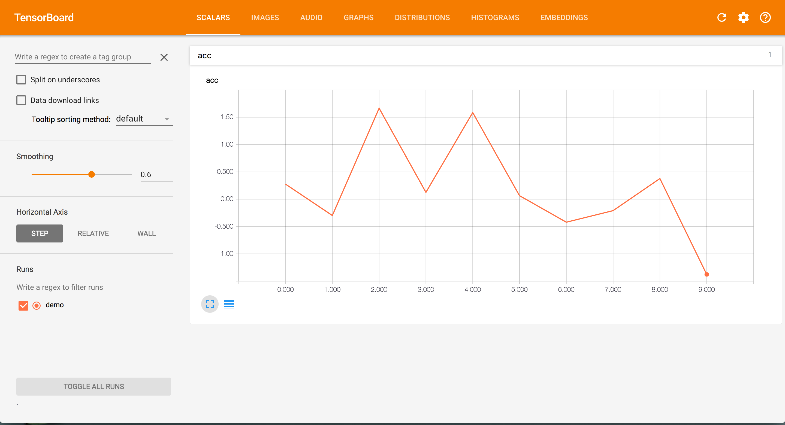
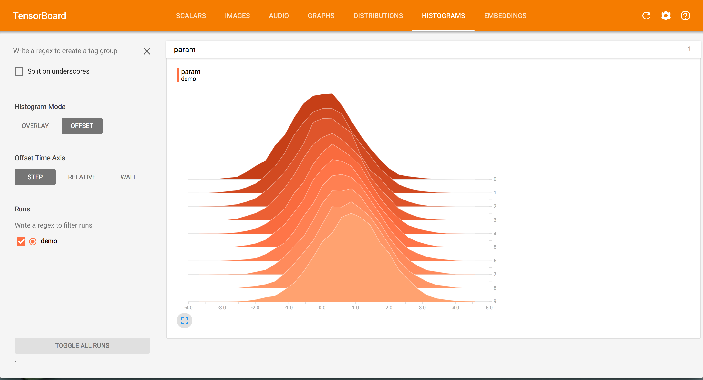

# TensorBoard Logger

C++ API to log data in tensorboard format. Only support `scalar` and `histogram`
at the moment.

# Acknowledgement

Inspired by [dmlc tensorboard](https://github.com/dmlc/tensorboard) project.

CRC code from [The SNIPPETS Portable C/C++ Source Code Collection](http://web.archive.org/web/20080303102530/http://c.snippets.org/snip_lister.php?fname=crc_32.c), via http://stackoverflow.com/a/303020, with some modifications.
