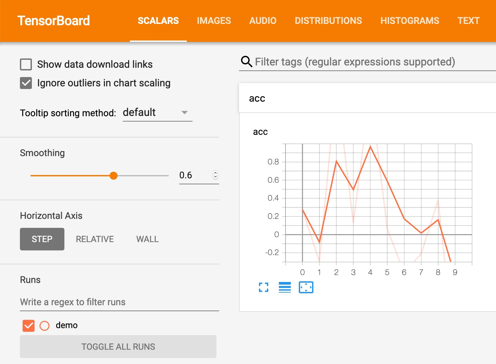
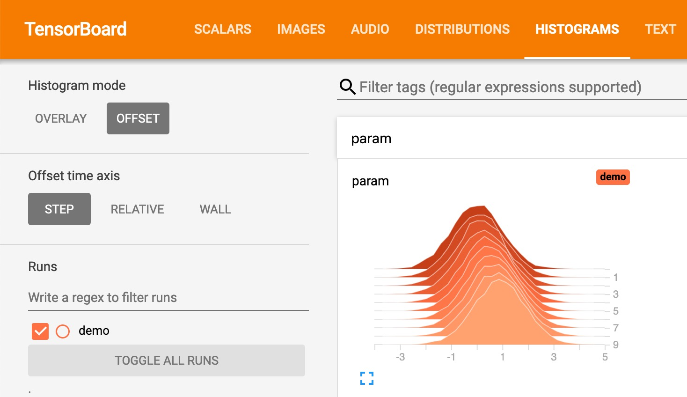
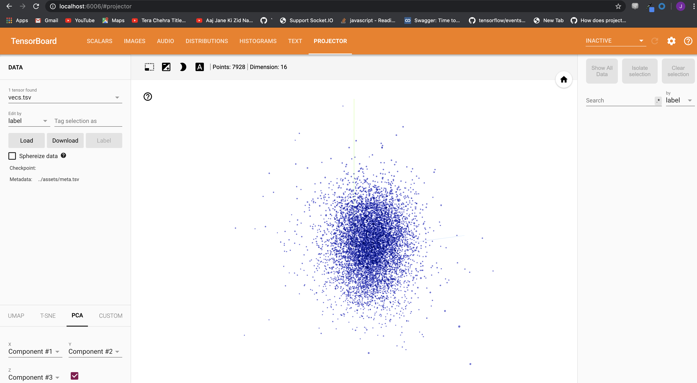
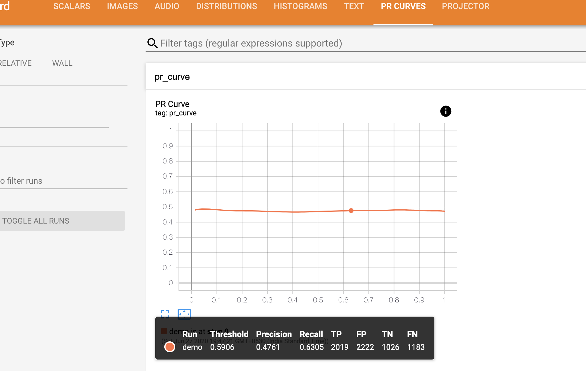

# TensorBoard Logger

Standalone C++ API to log data in TensorBoard format, without any code dependency on TensorFlow or TensorBoard.

Only support `scalar`, `histogram`, `image`, `audio` `text` and `projector` at the moment.

# Acknowledgement

- Inspired by [dmlc tensorboard](https://github.com/dmlc/tensorboard) project.

- CRC code from [The SNIPPETS Portable C/C++ Source Code Collection](http://web.archive.org/web/20080303102530/http://c.snippets.org/snip_lister.php?fname=crc_32.c), via http://stackoverflow.com/a/303020, with some modifications.

- Image sample from [Wikipedia](https://en.wikipedia.org/wiki/Lenna).

- Audio sample from [File Examples](https://file-examples.com/index.php/sample-audio-files/sample-wav-download/).
