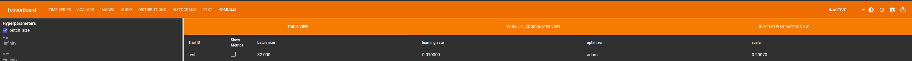

# TensorBoard Logger

Standalone C++ API to log data in TensorBoard format, without any code dependency on TensorFlow or TensorBoard.

Only support `scalar`, `histogram`, `image`, `audio` `text` and `projector` at the moment.

## Using the library

### CMake

Protobuf is the only dependency and assumed to be available via cmake's `find_package`.

To build and install TensorBoard Logger with cmake:

```bash
> BUILD_DIR=build
> mkdir -p $BUILD_DIR && cmake -B $BUILD_DIR . && cmake --build $BUILD_DIR -j
> cmake --install $BUILD_DIR
```

Alternatively to build a shared library set `BUILD_SHARED_LIBS=ON`:

```bash
> BUILD_DIR=build
> mkdir -p $BUILD_DIR && cmake -B $BUILD_DIR -DBUILD_SHARED_LIBS=ON . && cmake --build $BUILD_DIR -j
> cmake --install $BUILD_DIR
```

Then use `find_package(tensorboard_logger REQUIRED)` in your project.

Alternatively use via cmake FetchContent:

```cmake
FetchContent_Declare(
    tensorboard_logger
    GIT_REPOSITORY      https://github.com/RustingSword/tensorboard_logger.git
    GIT_TAG             master
)
FetchContent_MakeAvailable(tensorboard_logger)
```

Make sure to add `tensorboard_logger` to `target_link_libraries` of your projects target.

To run the test:

```bash
> BUILD_DIR=build
> mkdir -p $BUILD_DIR && cmake -DBUILD_TEST=ON -B $BUILD_DIR . && cmake --build $BUILD_DIR -j
> mkdir -p demo && ./$BUILD_DIR/tensorboard_logger_test
> tensorboard --logdir demo  # try adding --load_fast=false if you don't see projector tab
```

### Bazel

To use TensorBoard Logger with Bazel, add the following to your `MODULE.bazel` file:

```
bazel_dep(name = "tensorboard_logger")
git_override(
    module_name = "tensorboard_logger",
    branch = "master",
    remote = "https://github.com/RustingSword/tensorboard_logger.git",
)
```

And then to use the added dependency in your `BUILD.bazel` file, you can do:
```
cc_binary(
    name = "...",
    srcs = [...],
    deps = [
        "@tensorboard_logger",
        ...
    ],
)
```

## Screenshots




## Acknowledgement

- Inspired by [dmlc tensorboard](https://github.com/dmlc/tensorboard) project.

- CRC code from [The SNIPPETS Portable C/C++ Source Code Collection](http://web.archive.org/web/20080303102530/http://c.snippets.org/snip_lister.php?fname=crc_32.c), via <http://stackoverflow.com/a/303020>, with some modifications.

- Audio sample from [File Examples](https://file-examples.com/index.php/sample-audio-files/sample-wav-download/).
